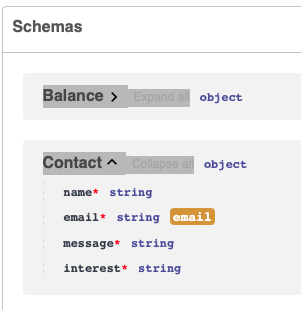

## Instructions for challenged

This project is already prepared with a instructions for you to create a docker image and run it so that you have your api environment without the need to configure the entire project.

Follow the instructions below to carry out the procedure.


# Requirements

- Terminal

**For Linux**
- Docker

**For macOS or Windows**
- Rancher Desktop or Docker Desktop 

> **Attention:** If you are using Windows, you need to run the terminal as administrator.
>
> Prefer Rancher Desktop, it is free, more complete and has more features

## 1. Create Image

```bash
docker build -t "dev-challenge" .
```

### 2. Check if image was created

```bash
docker images
```
## 3. Run container

```bash
docker run -d --name dev-challenge-demo -p 8000:8000 dev-challenge:latest
```

## 4. Check if container is running

```bash
docker ps
```

## 5. Access the API

- [http://localhost:8000](http://localhost:8000)

## Stop container

When you need to stop the container, run the code below in your terminal

```bash
docker stop dev-challenge-demo
```

## Api Documentation information

The project documentation uses swagger, where you will find the routes, parameters and schematics of each of the routes created for your challenge, in addition to being able to execute the routes directly in the documentation.

- [http://localhost:8000/docs](http://localhost:8000/docs)

Routes with authentication have a padlock icon




## Challanges

### Front-End

- [Challange 1. Contact Form](challange_frontend1.md)
 
### Back-End

- [Challange 1. Contact Form](challange_backend1.md)